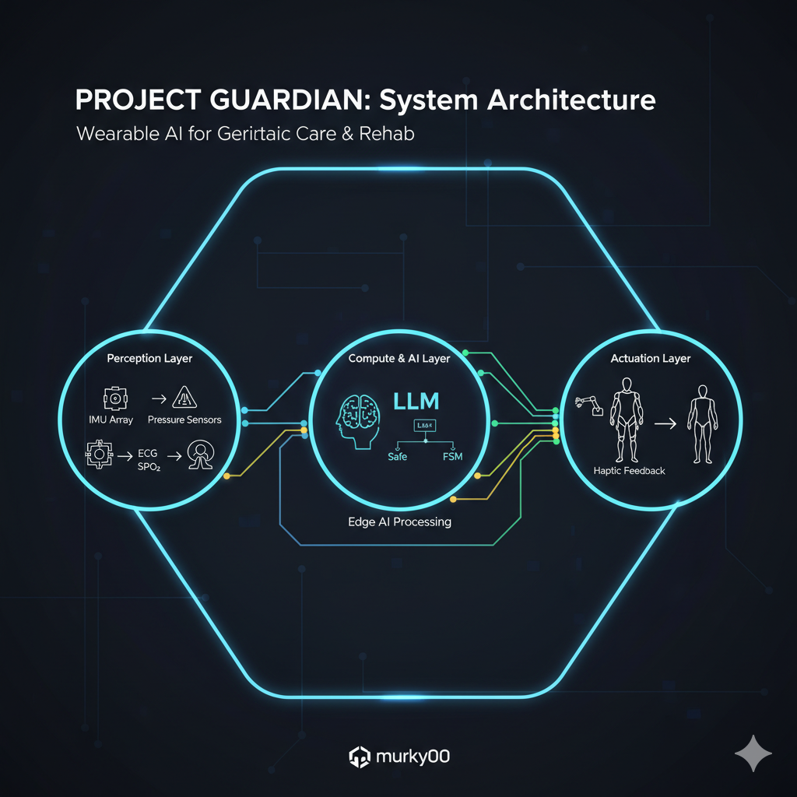
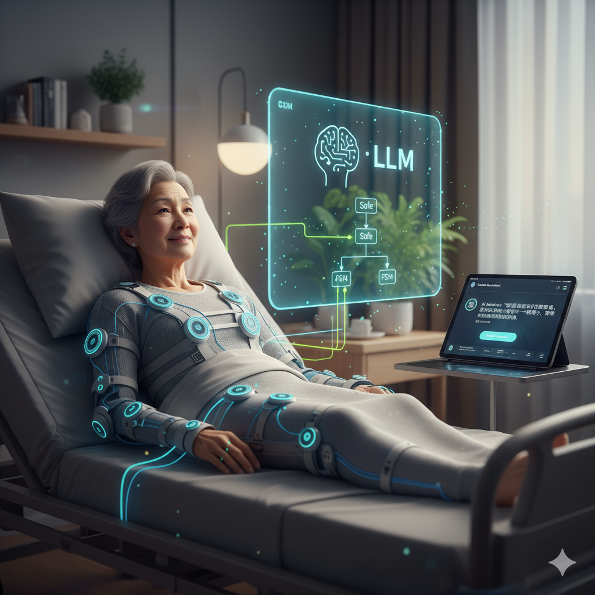
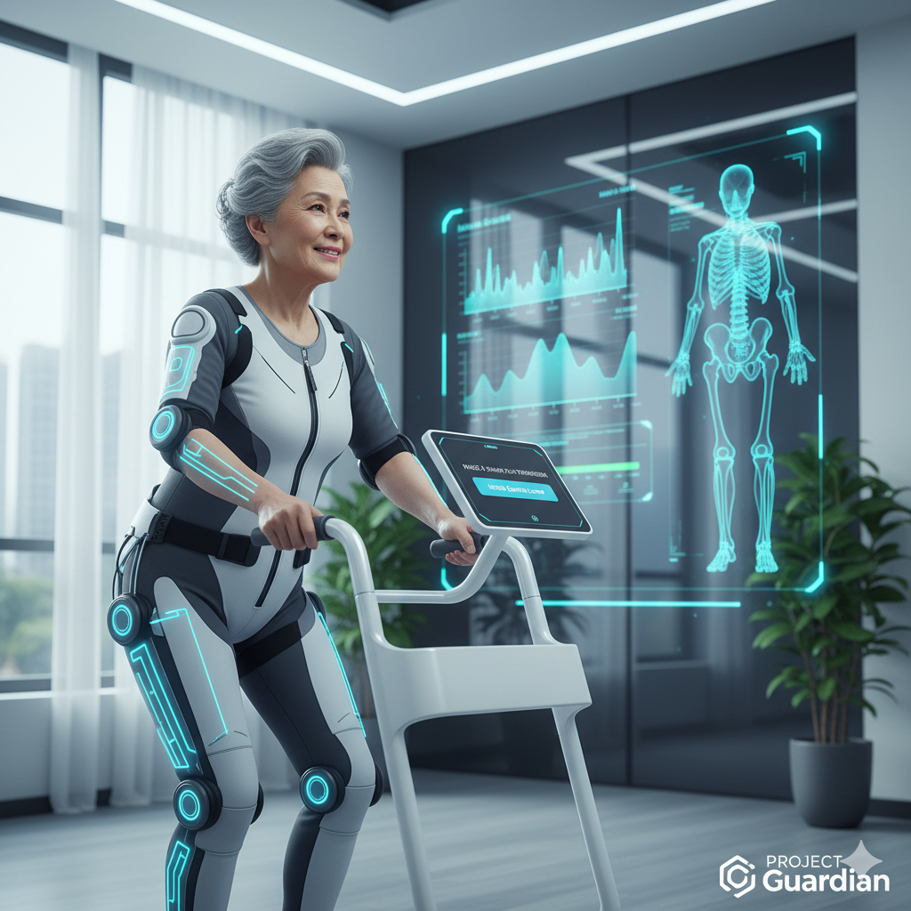

# Project Guardian

> 基于动捕外骨骼与端侧AI的居家高龄重症康复护理系统

## 1. 项目愿景
为高龄重症失能患者构建低成本、高安全性的个人数字护理辅助设备，实现 24 小时生命监测、防压疮管理及渐进式康复训练。

## 2. 系统工程架构
- **感知层 (Perception):** IMU 动捕集群 + 生理指标传感器。
- **计算层 (Compute):** 端侧大模型 (LLM) 进行状态评估与异常检测。
- **执行层 (Execution):** 柔性外骨骼 + 安全有限状态机 (Safe FSM)。

## 3. 研发路线图
- [ ] **Phase 1: 赛博护工** - 数据链路与防褥疮预警算法。
- [ ] **Phase 2: 柔性唤醒** - 基础外骨骼执行与 ROM 维持。
- [ ] **Phase 3: 钢铁支撑** - 卧姿到站姿的 FSM 安全平缓过渡。

## 4. 开发与部署
本项目引入自动化智能代理机制：
- **开发环境:** 基于 SSH 远程协同，本地计算节点（Win11/Ubuntu + GPU）自动处理仿真与任务。
- **任务管理:** 使用 GitHub Issues 进行驱动。

## 5. 免责声明
本项目为开源工程探索，非医疗器械。所有康复行为必须在医学评估下进行。

# Project_Guardian
基于动捕外骨骼与端侧AI的居家高龄重症康复护理系统

## 📖 Project Vision
本项目旨在为高龄重症康复期（脑卒中后遗症、心力衰竭伴发）失能患者构建一套低成本、高安全性的个人数字护理与辅助设备。
通过集成可穿戴传感器（IMU陀螺仪、血氧心率监测）、端侧轻量化大模型（Edge AI）以及基于有限状态机（FSM）控制的柔性外骨骼，实现**24小时生命体征监测、体位防压疮管理**以及**安全的渐进式被动/主动康复训练**。

## 🧬 Clinical Constraints & Context
*   **目标画像：** 亚洲女性，高龄，脑出血恢复期，曾发急性心衰与重度肺炎。
*   **肢体状态：** 左侧完全偏瘫（Brunnstrom分级 I期，肌力0级/T0失能），无自主张力，需极高防脱位与防压疮保护。
*   **心肺状态：** 心肺代偿能力弱，体位改变（如起坐、站立）极易引发体位性低血压或二次心衰。

## 🏗️ System Architecture

### 📡 Perception Layer
*   **生理参数采集：** 连续血氧（SpO2）、心率（HR）、血压趋势（BP）实时监控。
*   **物理空间动捕：** 部署于患者肢体/躯干的 IMU 陀螺仪节点集群，实时解算三维空间姿态。

### 🧠 Compute & Edge AI Layer
*   **端侧轻量级模型部署：** 时序数据异常检测（LSTM/Transformer-lite）。
*   **体征预警引擎：** 
    *   *防褥疮打卡：* 识别同一物理姿态超时（>2小时）并触发翻身警报。
    *   *心肺衰竭预警：* 捕捉静息状态下血氧阴跌或心率异常飙升。
    *   *神经痉挛捕捉：* 识别肢体高频微震（预判癫痫或肌张力突变）。

### ⚙️ Execution Layer: Exoskeleton & FSM
*   **安全状态机 (Safety-Critical FSM)：**
    *   **State 0:** 紧急锁死与平躺回退（最高优先级，由心肺数据骤降触发）。
    *   **State 1 -> N:** 极缓平躺 -> 摇高床头 -> 靠坐 -> 悬垂坐 -> 辅助起立。
    *   **State 转换条件 (Trigger)：** 严格绑定实时血压波动与心率阈值，拒绝任何突发过载动作。
*   **柔性辅助执行机构：** 提供软瘫期被动关节活动（ROM）维持，防止关节僵硬与肩关节半脱位。

## 🤝 Join Us
*   **Discord Server:**[Discord邀请链接，待补充]
*   **Tech Stack:** C++ / Python / ROS / PyTorch Lite / Arduino or ESP32 (可按实际修改)
*   欢迎算法工程师、硬件创客、康复理疗师、临床医生加入跨界讨论！

***

